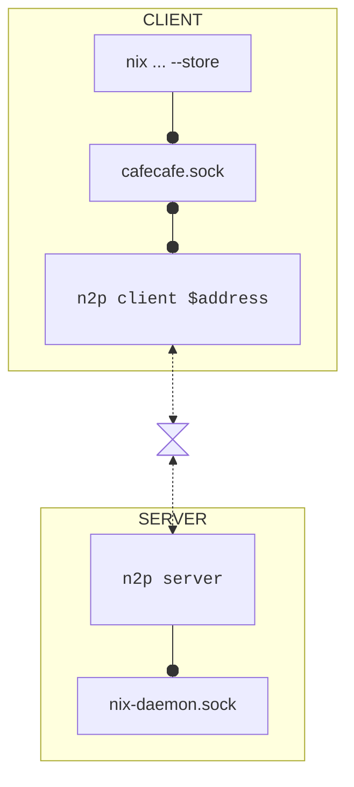

# N2P

> N2P (Nix to Peer)
> "share your daemons with your peers"

A P2P bridge between (Nix) daemons allowing `nix copy`
(and other store operations) on other machines without intermediaries
or excessive setup.

## USAGE

### `n2p server`

Starts a local node that forwards connections to the local nix daemon socket.
Logs "short" and "long" addresses to stderr, that can be used to connect a client.

### `n2p client <address>`

Sets up a local unix socket that can be used by nix in the url position of arguments
that take store urls (e.g. `nix copy --to <url>`).

#### Example

```bash
# start a client (needs to keep running in the background)
$ n2p client <address>
2025-09-20T19:07:34.773677Z  INFO n2p: unix:/Users/me/here/there/8a88e3dd7409.sock

# copy to the socket opened by the client which copies it over to the remote server
$ nix copy --to unix:/Users/me/here/there/8a88e3dd7409.sock <installable>
```

## Motivation

Nix provides access to abstract "stores" via the [`Store`](https://github.com/NixOS/nix/blob/master/src/libstore/include/nix/store/store-api.hh) interface.
This allows e.g. copying store paths from from/to paths on the file system, S3 servers, HTTP(S) file servers, and machines with SSH access.

Most of the time these provide enough flexibility to move store paths around.
However, _accessible, secure, direct copies_ between two individual's machines are still suprisingly cumbersome.
Most store implementations require creating intermediate copies two a third medium
in contrast to allowing direct copies.

The `file:` implementation, would require a physical medium, that may be unavailable,  limited in size and perhaps distance unless both parties are physically close.
`http:|https:|s3:` require an external service, that again, may be limited in size,
requires setup and infrastructure. Additionally the service must be reachable publically on the internet or subscriptions to third party services are necessary.

The closest implementation Nix offers is the `ssh` and `ssh-ng` implementation.
These connect _directly_ to another machine and operate on the remote `/nix/store`.
However, these still require an SSH _server_ setup, key exchanges (including the risk of providing excessive access to machines) and publically available access.

## Direct connections over P2P tunnels

This project aims to close the gap left by Nix' built in store implementations.
The CLI `n2p` acts as server and client nodes on a P2P network.
In `server` mode, `n2p` accepts connections
and forwards them to the nix daemon running on the local system.
As a `client`, `n2p` provides a socket that can be used with Nix' `--store <url>` flag
(or `--from|to <url>` flags of `nix copy`).
All connections are transparently forwarded to the connected `server`.

For the P2P connection, this project uses [`iroh`](https://github.com/n0-computer/iroh),
because "it just works".





<details>
<summary>Is this just socket forwarding?<summary>
Yes, yes it is.
In fact this is a somewhat more restrictive,
use-case specific version of [dumbpipe](https://github.com/n0-computer/dumbpipe).
<details>
